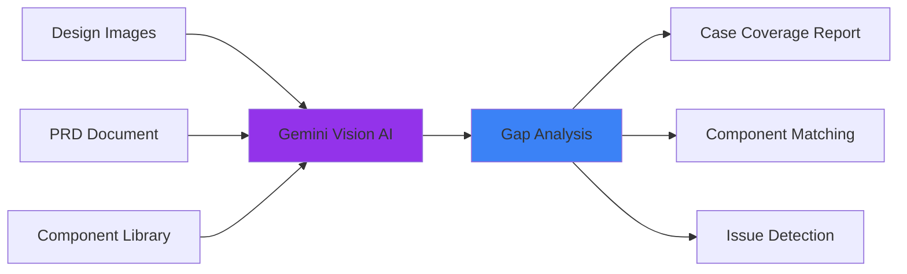
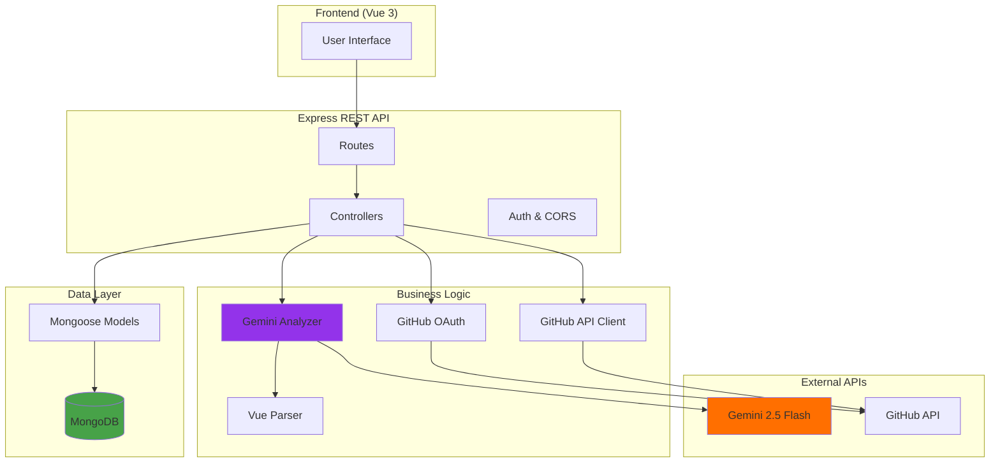
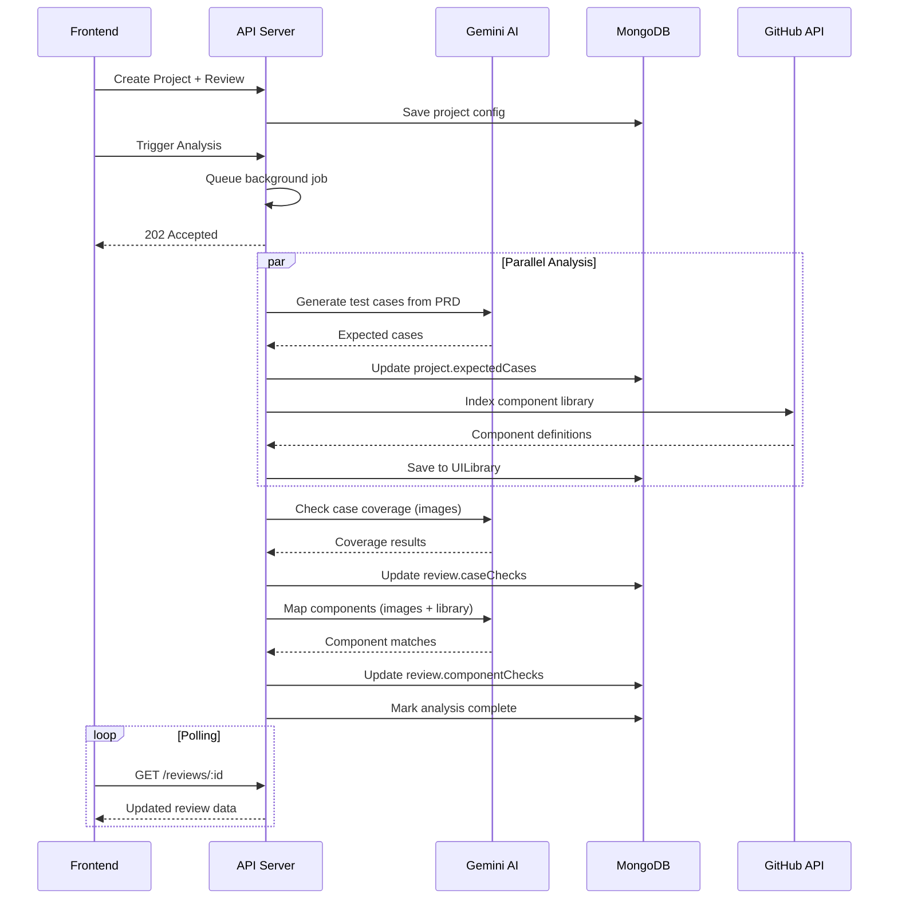
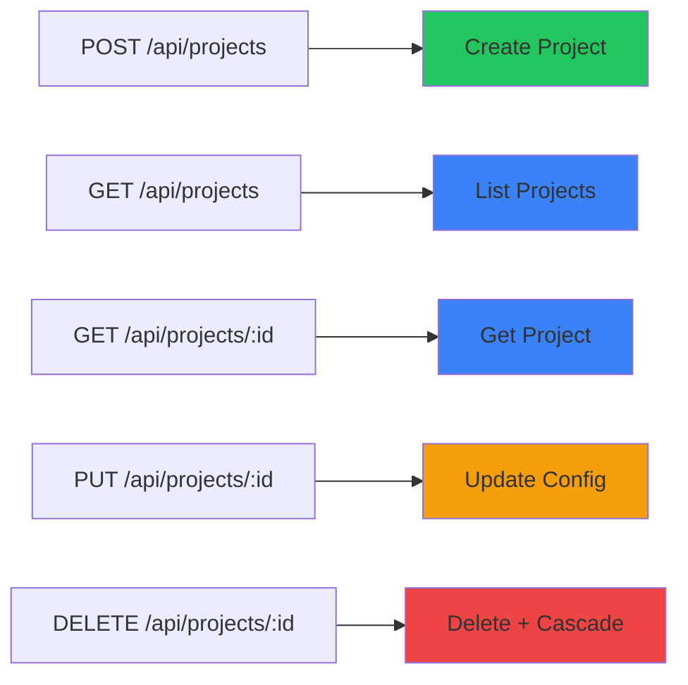
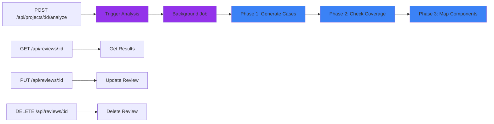
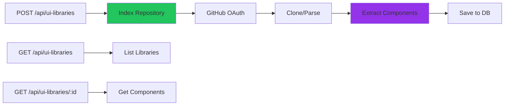
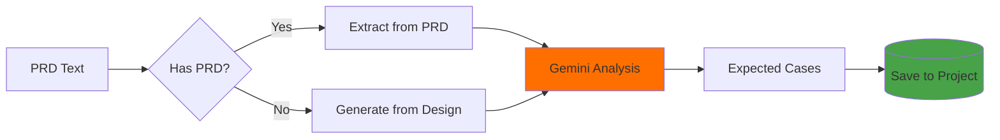
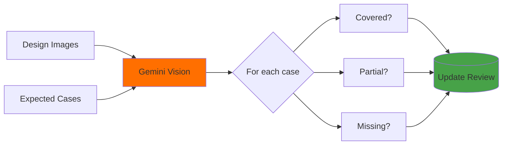
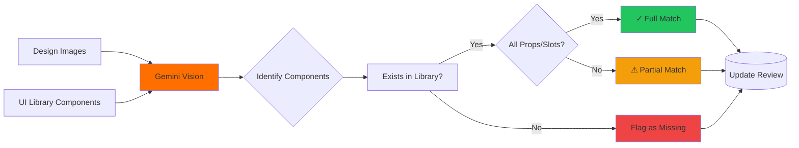
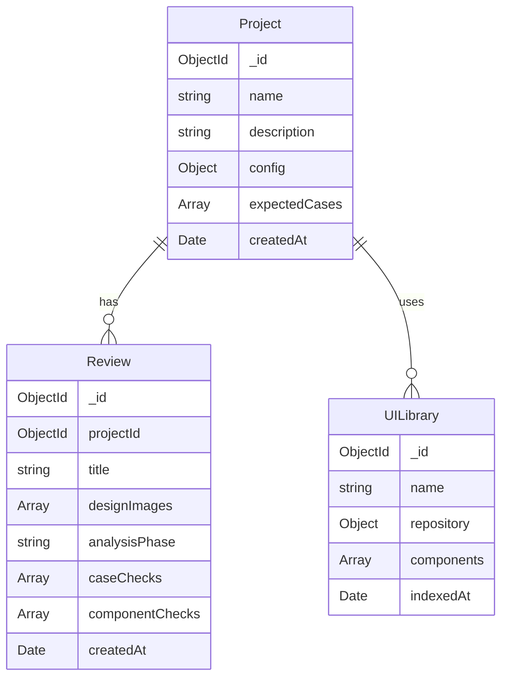

# DesignSync Backend

> **AI-Powered Design-to-Code Verification Engine**  
> Express + TypeScript + MongoDB + Gemini 2.5 Flash

[]() []()

---

## 🎯 What This Does

The backend powers DesignSync's AI-driven analysis pipeline that catches design implementation gaps before they reach development.

### Key Capabilities



---

## 🏗️ Architecture



---

## 📊 Data Flow



---

## 🚀 Quick Start

### Prerequisites

- Node.js 18+
- MongoDB (local or Atlas)
- Gemini API Key
- GitHub OAuth App

### Installation

```bash
# Install dependencies
npm install

# Configure environment
cp .env.example .env
# Edit .env with your credentials

# Start development server
npm run dev
```

### Environment Variables

```bash
PORT=3000
MONGODB_URI=mongodb://localhost:27017/designsync
GEMINI_API_KEY=your_gemini_key_here
GITHUB_CLIENT_ID=your_github_client_id
GITHUB_CLIENT_SECRET=your_github_client_secret
FRONTEND_URL=http://localhost:5173
```

---

## 📡 API Reference

### Projects



### Reviews (Design Analysis)



### UI Libraries



---

## 🧠 AI Analysis Pipeline

### Phase 1: Case Generation



### Phase 2: Coverage Check



### Phase 3: Component Mapping



---

## 🗄️ Database Schema



---

## 🛠️ Tech Stack

| Layer | Technology | Purpose |
|-------|-----------|---------|
| **Runtime** | Node.js 18+ | JavaScript runtime |
| **Framework** | Express.js | REST API server |
| **Language** | TypeScript | Type safety |
| **Database** | MongoDB + Mongoose | Data persistence |
| **AI** | Gemini 2.5 Flash | Vision analysis |
| **Auth** | GitHub OAuth | Private repo access |
| **Parser** | Custom Vue SFC parser | Component extraction |

---

## 📁 Project Structure

```
designsync-server/
├── src/
│   ├── controllers/          # Request handlers
│   │   ├── projectController.ts
│   │   ├── reviewController.ts
│   │   ├── uiLibraryController.ts
│   │   └── authController.ts
│   ├── models/               # Mongoose schemas
│   │   ├── Project.ts
│   │   ├── Review.ts
│   │   └── UILibrary.ts
│   ├── services/             # Business logic
│   │   ├── geminiAnalyzer.ts    # AI analysis
│   │   ├── githubService.ts     # GitHub API
│   │   └── vueParser.ts         # Component parsing
│   ├── routes/               # API routes
│   │   ├── projectRoutes.ts
│   │   ├── reviewRoutes.ts
│   │   ├── uiLibraryRoutes.ts
│   │   └── authRoutes.ts
│   └── server.ts             # App entry point
├── .env                      # Environment config
├── package.json
└── tsconfig.json
```

---

## 🎯 Key Features

### ✅ Type-Safe API
- Full TypeScript coverage
- Mongoose type definitions
- Compile-time error checking

### ✅ Async Job Processing
- Non-blocking analysis
- Progress tracking via phases
- Graceful error handling

### ✅ Smart Component Detection
- Regex-based Vue SFC parsing
- Props, slots, variants extraction
- Framework-agnostic design

### ✅ Deduplication Logic
- Component name normalization
- Intelligent merging of props/slots
- Handles AI response variations

### ✅ Security
- GitHub OAuth for private repos
- Scoped API access
- Token encryption at rest

---

## 🔧 Development

### Build

```bash
npm run build
```

### Start Production

```bash
npm start
```

### Type Check

```bash
npx tsc --noEmit
```

---

## 📈 Performance Considerations

- **Analysis Time**: ~30-60 seconds per review (3 AI calls)
- **Concurrent Analyses**: Queued via background jobs
- **Rate Limits**: Gemini API ~60 req/min
- **Database**: Indexed on `projectId`, `createdAt`

---

## 🎓 Built for Dev Nitro 2026

**Theme**: Quality Enhancement  
**Problem**: Design-to-dev handoff gaps cause 8-12 hours of rework per feature  
**Solution**: AI-powered verification before development starts

---

## 📄 License

Internal use only. All code becomes company IP per contest rules.
